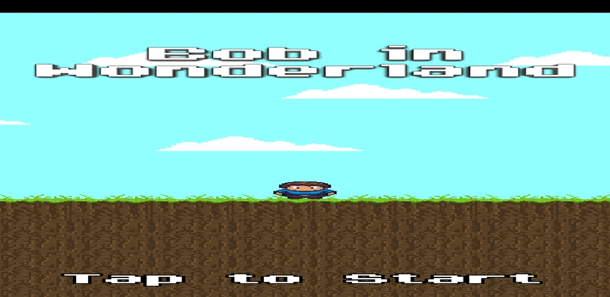
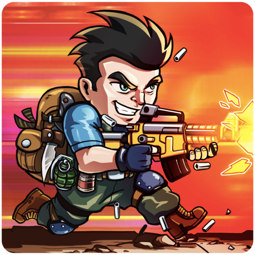
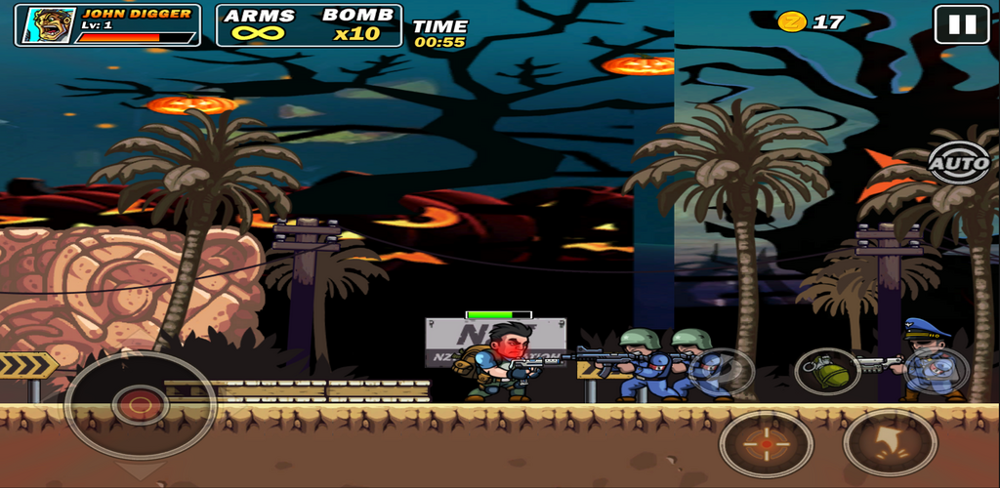
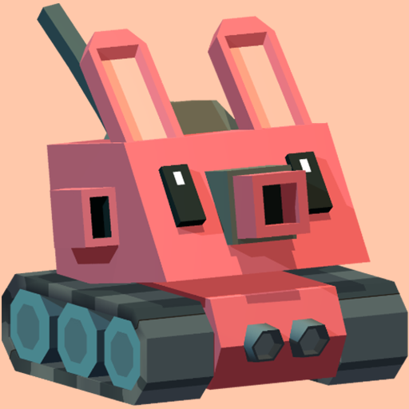
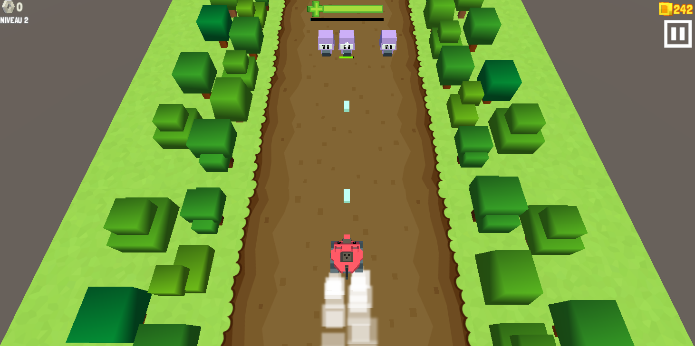
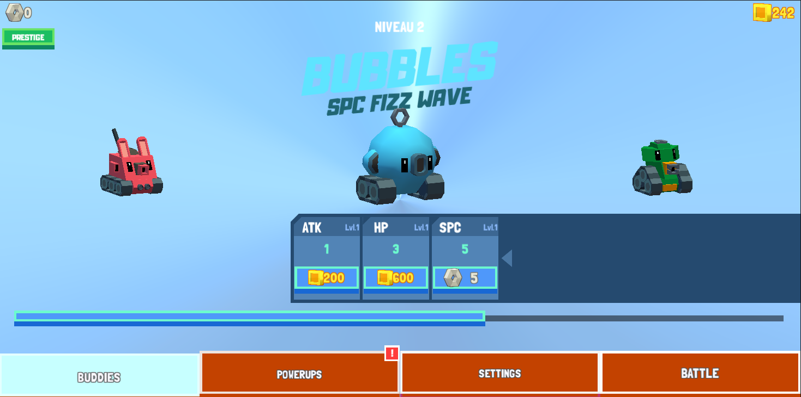
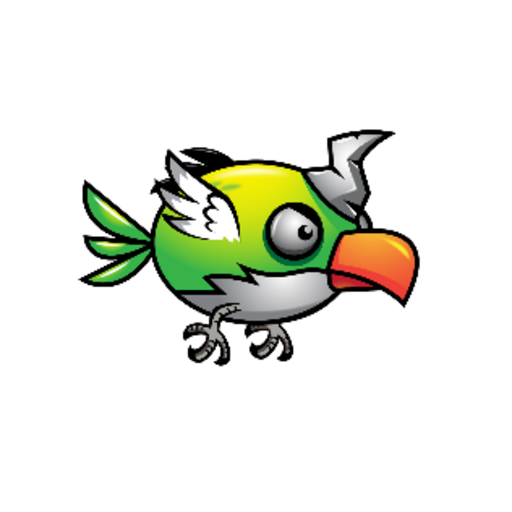
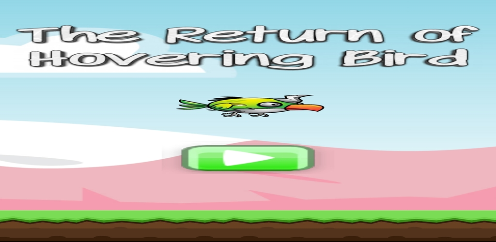
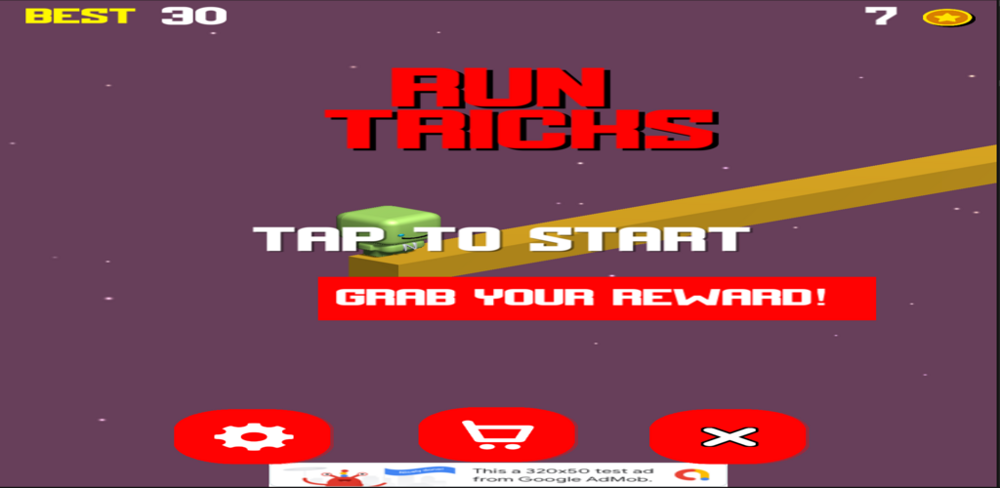
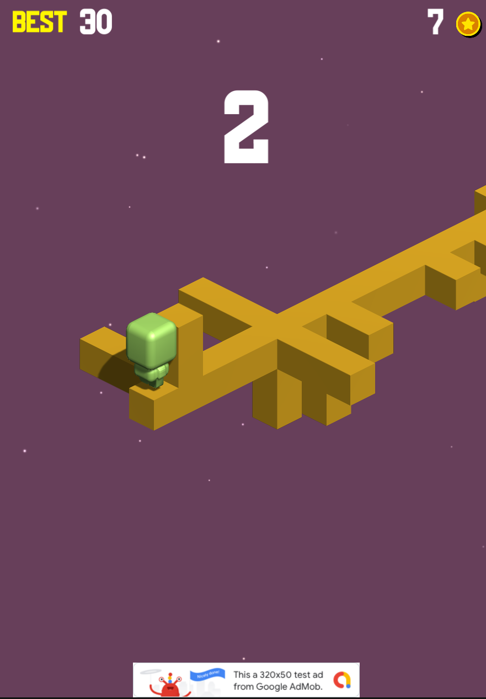

# 🎮 Android Games Bundle — Unity Source Code Pack

> **Pack of 5 Android mobile games** built with **Unity**, including full source code, ready-to-publish builds (.aab / .apk), and graphic assets. Custom-developed Unity projects with full IP rights transferred to the seller.

**📦 Full source code is delivered to the buyer after purchase.** This repo is the public showcase only.

---

## 📋 Pack contents

| # | Game | Genre | Builds | Variant | iOS |
|---|------|-------|--------|---------|-----|
| 1 | **Bob In Wonderland** | Casual / Arcade | APK + AAB | — | — |
| 2 | **Metal Black** | Casual | Android Bundle | ✅ Variant included | — |
| 3 | **Speed Block** | Hyper-Casual | Android Bundle | ✅ Updated build | ✅ |
| 4 | **The Return Of Hovering Bird** | Arcade | APK + AAB | — | — |
| 5 | **Visual Trick** | Casual / Puzzle | Android Bundle | ✅ Updated build | ✅ |

---

## 🛠️ Tech stack

- **Engine** : Unity (full projects: `Assets/`, `ProjectSettings/`, `Packages/`)
- **Language** : C#
- **Platforms** : Android (primary) + iOS for 2 games
- **Monetization** : Google AdMob integrated (`GoogleMobileAds` SDK)
- **Delivery format** : `.apk`, `.aab` (Android App Bundle for Play Store)

---

## 🎯 Per-game details

### 1. Bob In Wonderland

  
   
  

- Full Unity project
- Production builds: `.aab` + `.apk`
- **Android keystore included** ✅
- ProGuard mapping + symbols for Play Console
- 512x512 icon + 1024x500 store screenshot

---

### 2. Metal Black

  
   
  

- Full Unity project
- Android Bundle ready
- **Visual variant included** ✅
- AdMob configured

---

### 3. Speed Block

  
   
  
  

- Android Bundle + iOS version ✅
- Updated Unity project source
- Final build archive included
- 2 store templates

---

### 4. The Return Of Hovering Bird

  
   
  
   
  

- Full Unity project
- `.aab` build + ProGuard mapping + symbols
- 512x512 icon + 1024x500 store screenshot
- Desktop mockup for marketing visuals

---

### 5. Visual Trick

  
  

- Android Bundle + iOS version ✅
- Updated Unity project source
- Complete delivery archive included
- 2 store templates

---

## ✅ What's included in the delivery

- Full Unity C# source code for all 5 games
- Ready-to-upload Android builds (`.aab` / `.apk`)
- iOS versions (Speed Block, Visual Trick)
- Android keystore (Bob In Wonderland)
- ProGuard mapping + symbols (Play Console debugging)
- High-resolution icons (512x512)
- Store screenshots + marketing templates (1024x500)
- AdMob integration (SDK + scripts)
- `app-ads.txt` template
- Complete documentation

## ❌ What's NOT included

- Google Play Console accounts *(buyer to create)*
- AdMob accounts *(buyer's Publisher ID needed)*
- Apple Developer Account
- Bundle IDs *(placeholder values — buyer must change to their own)*

---

## 🚀 Quick start for the buyer

1. Install **Unity Hub** + a recent Unity LTS version
2. Open a project: *Unity Hub → Add → select the game folder*
3. Replace the **AdMob IDs** in scripts with your own
4. Update `app-ads.txt` with your AdMob Publisher ID
5. Change Bundle ID in Player Settings (e.g. `com.yourstudio.gamename`)
6. Generate your own keystores for games that don't include one
7. **Build**: `File → Build Settings → Android → Build`
8. Publish on **Google Play Console**

---

## 💼 License & rights

Upon purchase, the buyer receives:
- All listed source files
- Unlimited usage, modification, and publishing rights
- Right to resell **published** games (live apps with revenue)

The buyer is responsible for:
- Creating their own accounts (Google Play, AdMob, Apple)
- Generating their own application IDs and monetization IDs
- Compliance with Google Play and App Store policies

**IP & Originality**: All games were custom-developed under work-for-hire agreements with full intellectual property rights transferred to the current seller. Documentation of rights transfer is available upon request.

---

## 📞 Contact & purchase

> *For gameplay videos, negotiation, or questions: [contact info to add]*

**Available on**: [Marketplace listing link to add]

---

*Pack sold as-is. Projects were developed under Unity and may require an update to a recent Unity version before store publishing.*
